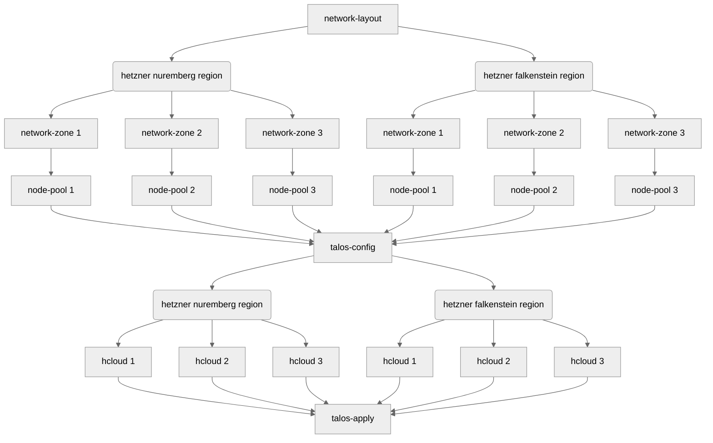

# terraform-talos-modules
This repository contains a collection of opinionated terraform modules for running [talos](https://www.talos.dev) on [hetzner](https://www.hetzner.com).

## modules
1. [network-layout](modules/network-layout) manages global cidrs and private ips
2. [network-zone](modules/network-zone) manages regional / zonal cidrs and private ips
3. [node-pool](modules/node-pool) manages control planes and workers
4. [talos-config](modules/talos-config) manages talos configs for all machines
5. [hcloud](modules/hcloud) manages hcloud networks, servers, load balancers, firewalls, routers
6. [talos-apply](modules/talos-apply) bootstraps cluster and applies configs to running machines

## examples
See [examples](examples) folder.

## overview
The following [mermaid](https://github.com/mermaid-js/mermaid) flowchart outlines the order of operations between different modules for a cluster, spanning two different regions.

..each zone contains
- one network with multiple subnets
- one or more control planes and workers, all without public interface
- one load balancer, handling all incoming requests via ipv4
- one router (with a firewall and optional test client), giving servers access to the internet via ipv4
