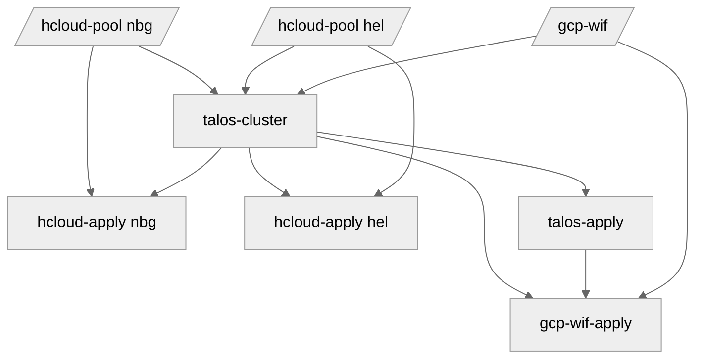

# terraform-talos-modules
Modules in this repository help provision and maintain multi-region [kubernetes](https://kubernetes.io) clusters on [hetzner](https://www.hetzner.com).

## features
- [talos](https://www.talos.dev) with kubespan, kubeprism and hostdns
- ipv6-only connectivity, with optional ipv4 private networks and load balancers (cilium requires additional configuration)
- single-stack, ipv6 internals (dual-stack possible with additional patches)
- [cilium](https://cilium.io) - direct routing (veth), bigtcp and bbr
- [talos-ccm](https://github.com/siderolabs/talos-cloud-controller-manager) - handles cluster certificates and ipam (CloudAllocator)
- [hcloud-csi](https://github.com/hetznercloud/csi-driver) - storage
- [gcp-wif-webhook](https://github.com/pfnet-research/gcp-workload-identity-federation-webhook) - links kubernetes and gcp service accounts

## modules
1. [hcloud-pool](modules/hcloud-pool) - allocates public ipv6 /64 blocks for all defined nodes and optionally private network and a load balancer
2. [talos-cluster](modules/talos-cluster) - forms a talos cluster from previously defined node pools
3. [hcloud-apply](modules/hcloud-apply) - provisions servers with talos configs and sets up firewalls
4. [talos-apply](modules/talos-apply) - bootstraps the cluster and handles all future config changes
5. [gcp-wif](modules/gcp-wif) - optional, manages gcp workload identity pool, service accounts and a bucket, it also generates talos config patch
6. [gcp-wif-apply](modules/gcp-wif-apply) - optional, downloads oidc files from the running cluster and stores them in the previously created bucket

## examples
See [examples](examples) folder.

## diagram
The following [mermaid](https://github.com/mermaid-js/mermaid) flowchart outlines the order of operations between different modules for a cluster, spanning two regions.



## try it out
1. clone the repo
2. navigate to [dev](dev) folder and run [just](https://github.com/casey/just) to deploy the cluster (run it again, when it fails, to apply the gcp-wif)
3. navigate to [base](/) folder, open talos dashboard and wait for `[talos] created` messages
```shell
> TALOSCONFIG=talos-config talosctl -n c1 dashboard
```
4. run `just` to generate all necessary yaml files
5. apply them individually, `talos-ccm` and `cilium` are required
```shell
> KUBECONFIG=kube-config kubectl apply --server-side=true -f .build/manifests/talos-ccm.yaml
> KUBECONFIG=kube-config kubectl apply --server-side=true -f .build/manifests/cilium.yaml
...
```
6. open talos dashboard again and wait for the message `[talos] machine is running and ready`.
7. to verify, open [k9s](https://k9scli.io/)
```shell
> KUBECONFIG=kube-config k9s
```
