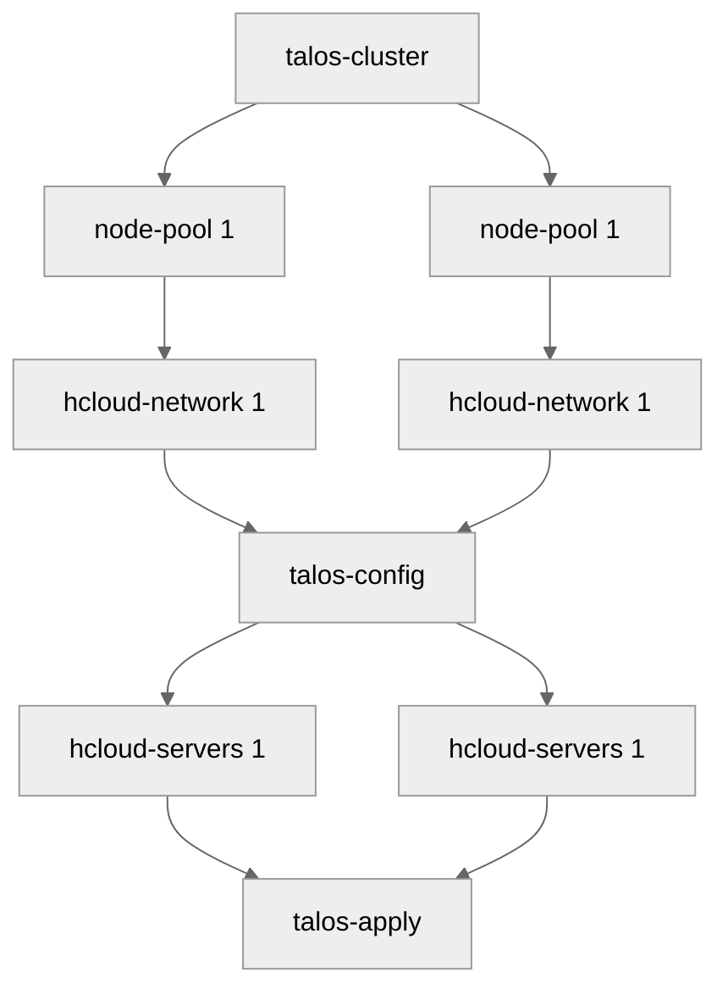

# terraform-talos-modules
This repository contains a collection of opinionated terraform modules for running [talos](https://www.talos.dev) on [hetzner](https://www.hetzner.com).

## features
- talos with kubespan, kubeprism and hostdns
- ipv6 and/or ipv4 connectivity
- hcloud ipv4 private network(s)
- dual stack internals
- [cilium](https://cilium.io)
- [talos-cloud-controller-manager](https://github.com/siderolabs/talos-cloud-controller-manager)

## modules
1. [talos-cluster](modules/talos-cluster) handles cluster-wide patches, including cni and ccm
2. [node-pool](modules/node-pool) handles machine-specific patches, defines machines and private ips
3. [hcloud-network](modules/hcloud-network) adds hetzner-specific patches, manages hcloud networks, firewalls and public ips
4. [talos-config](modules/talos-config) manages talos configs for all machines
5. [hcloud-servers](modules/hcloud-servers) manages hcloud servers and firewalls
6. [talos-apply](modules/talos-apply) bootstraps cluster and applies configs

## examples
See [examples](examples) folder.

## diagram
The following [mermaid](https://github.com/mermaid-js/mermaid) flowchart outlines the order of operations between different modules for a cluster, spanning two regions.

