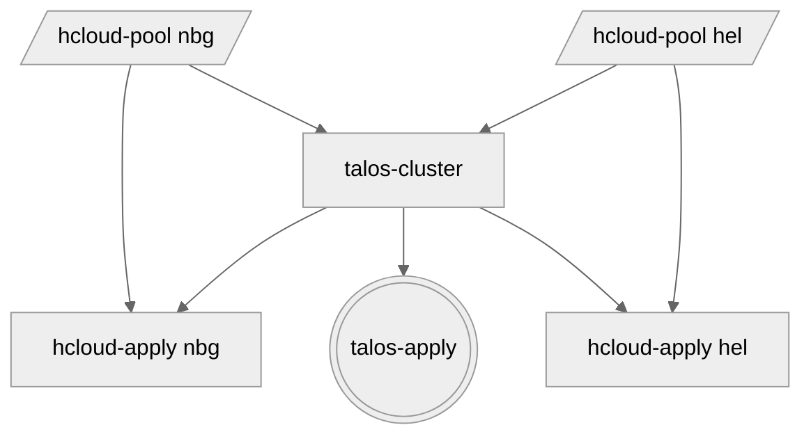

# terraform-talos-modules
Modules in this repository help provision and maintain multi-region [kubernetes](https://kubernetes.io) clusters on [hetzner](https://www.hetzner.com).

## features
- [talos](https://www.talos.dev) with kubeprism and hostdns, without kubespan
- ipv6-only connectivity
- single-stack, ipv6 internals
- [cilium](https://cilium.io) - direct routing (veth), bigtcp, bbr and pod-to-pod wireguard encryption
- [talos-ccm](https://github.com/siderolabs/talos-cloud-controller-manager) - certificates and ipam (CloudAllocator)
- [hcloud-csi](https://github.com/hetznercloud/csi-driver) - storage

## modules
1. [hcloud-pool](modules/hcloud-pool) allocates public ipv6 /64 blocks for all defined nodes
2. [talos-cluster](modules/talos-cluster) forms a talos cluster from previously defined node pools
3. [hcloud-apply](modules/hcloud-apply) provisions servers with talos configs and sets up firewalls
4. [talos-apply](modules/talos-apply) bootstraps the cluster and handles all future config changes

## examples
See [examples](examples) folder.

## diagram
The following [mermaid](https://github.com/mermaid-js/mermaid) flowchart outlines the order of operations between different modules for a cluster, spanning two regions.



## try it out
1. clone the repo
2. navigate to [dev](dev) folder and run [just](https://github.com/casey/just) to deploy the cluster
3. open talos dashboard and wait for `[talos] created` messages
```console
$ TALOSCONFIG=talos-config talosctl -n c1 dashboard
```
4. navigate to [manifests](manifests) folder and run `just` to generate all necessary yaml files
5. apply them individually, `talos-ccm` and `cilium` are required
```console
$ KUBECONFIG=../dev/kube-config kubectl apply --server-side=true -f talos-ccm.yaml
$ KUBECONFIG=../dev/kube-config kubectl apply --server-side=true -f cilium.yaml
...
```
6. open talos dashboard again and wait for the message `[talos] machine is running and ready`.
7. to verify, open [k9s](https://k9scli.io/)
```console
$ KUBECONFIG=kube-config k9s
```
