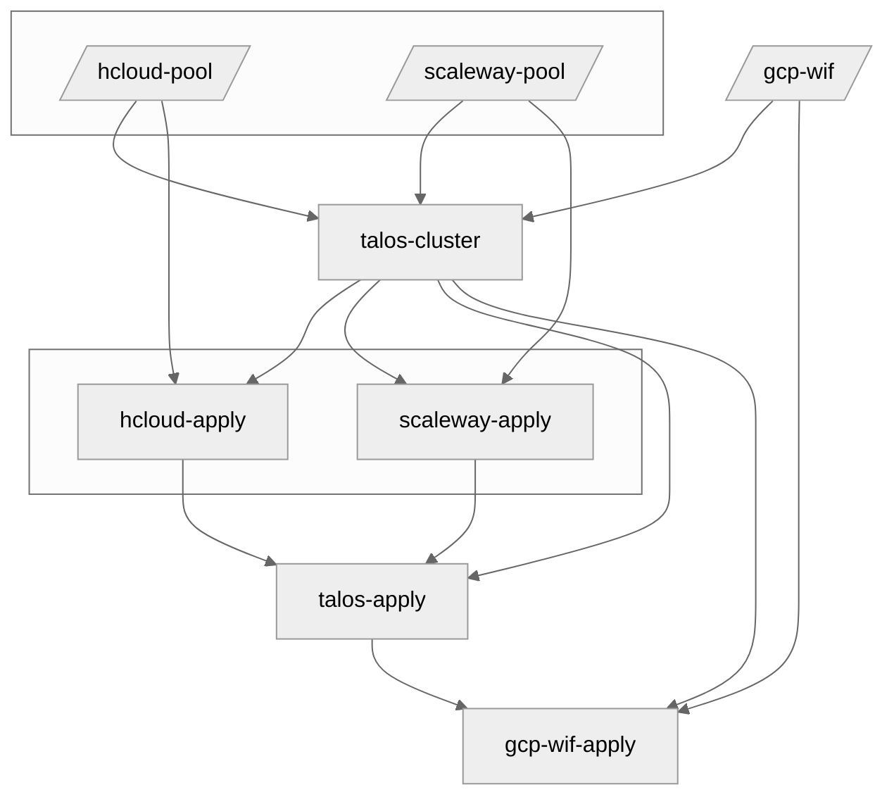

# terraform-talos-modules
Modules in this repository help provision and maintain multi-region [Kubernetes](https://kubernetes.io) clusters on [Hetzner Cloud](https://www.hetzner.com) and [Scaleway](https://www.scaleway.com).

## features
- [Talos Linux](https://www.talos.dev) with KubeSpan, KubePrism and HostDNS
- IPv6-only node connectivity (NAT64 for outbound IPv4)
- Single-stack IPv6 internals (dual-stack possible with additional patches)
- [Cilium](https://cilium.io) - tunnel mode (netkit), BigTCP and BBR
- [talos-ccm](https://github.com/siderolabs/talos-cloud-controller-manager) - optional, node IPAM (CloudAllocator) and cloud metadata, requires additional patches (see [examples/talos-ccm.tf](examples/talos-ccm.tf))
- [gcp-wif](modules/gcp-wif) + [gcp-wif-apply](modules/gcp-wif-apply) - optional GCP Workload Identity Federation integration

## modules

### cloud pools
Allocate node resources (IPs, placement groups). Pass their outputs to `talos-cluster` and the corresponding apply module.

| module | provider | description |
|---|---|---|
| [hcloud-pool](modules/hcloud-pool) | Hetzner Cloud | allocates IPv6 /64 blocks and a placement group |
| [scaleway-pool](modules/scaleway-pool) | Scaleway | allocates routed IPv6 + IPv4 IPs and a placement group |

### cluster
| module | description |
|---|---|
| [talos-cluster](modules/talos-cluster) | generates machine secrets, config patches and user_data for all nodes |
| [talos-apply](modules/talos-apply) | bootstraps the cluster, manages config changes and rolling upgrades |

### apply
Provision servers. One apply module per pool.

| module | provider | description |
|---|---|---|
| [hcloud-apply](modules/hcloud-apply) | Hetzner Cloud | provisions servers and firewalls |
| [scaleway-apply](modules/scaleway-apply) | Scaleway | provisions servers, volumes and security groups |

### optional
| module | description |
|---|---|
| [scaleway-image](modules/scaleway-image) | registers a Talos qcow2 image from a Scaleway bucket as a bootable instance image |
| [gcp-wif](modules/gcp-wif) | manages a GCP workload identity pool, service accounts and OIDC bucket |
| [gcp-wif-apply](modules/gcp-wif-apply) | fetches OIDC documents from the running cluster and uploads them to GCP |

## examples
See the [examples](examples) folder.

## diagram
The following [Mermaid](https://github.com/mermaid-js/mermaid) flowchart outlines the order of operations between modules for a cluster spanning two regions.


```mermaid
%%{init: {'theme': 'neutral'} }%%
graph TD
    subgraph pools[ ]
        HPN[/hcloud-pool/]
        SPN[/scaleway-pool/]
    end
    subgraph apply[ ]
        HA[hcloud-apply]
        SA[scaleway-apply]
    end
    WIF[/gcp-wif/]
    TC[talos-cluster]
    TA[talos-apply]
    WIFA[gcp-wif-apply]
    HPN --> TC
    HPN --> HA
    SPN --> TC
    SPN --> SA
    WIF --> TC
    WIF --> WIFA
    TC --> HA
    TC --> SA
    TC --> TA
    TC --> WIFA
    HA --> TA
    SA --> TA
    TA --> WIFA
```

## try it out
1. Clone the repo
2. Navigate to the [dev](dev) folder and run [just](https://github.com/casey/just) to deploy the cluster
3. Open the Talos dashboard and wait for nodes to become ready
```shell
> TALOSCONFIG=talos-config talosctl -n c1 dashboard
```
4. Run `just` from the repo root to generate manifests from the [manifests](manifests) directory, then apply them - `talos-ccm` and `cilium` are required
```shell
> KUBECONFIG=kube-config kubectl apply --server-side=true -f .build/manifests/talos-ccm.yaml
> KUBECONFIG=kube-config kubectl apply --server-side=true -f .build/manifests/cilium.yaml
```
5. Verify with [k9s](https://k9scli.io/)
```shell
> KUBECONFIG=kube-config k9s
```
