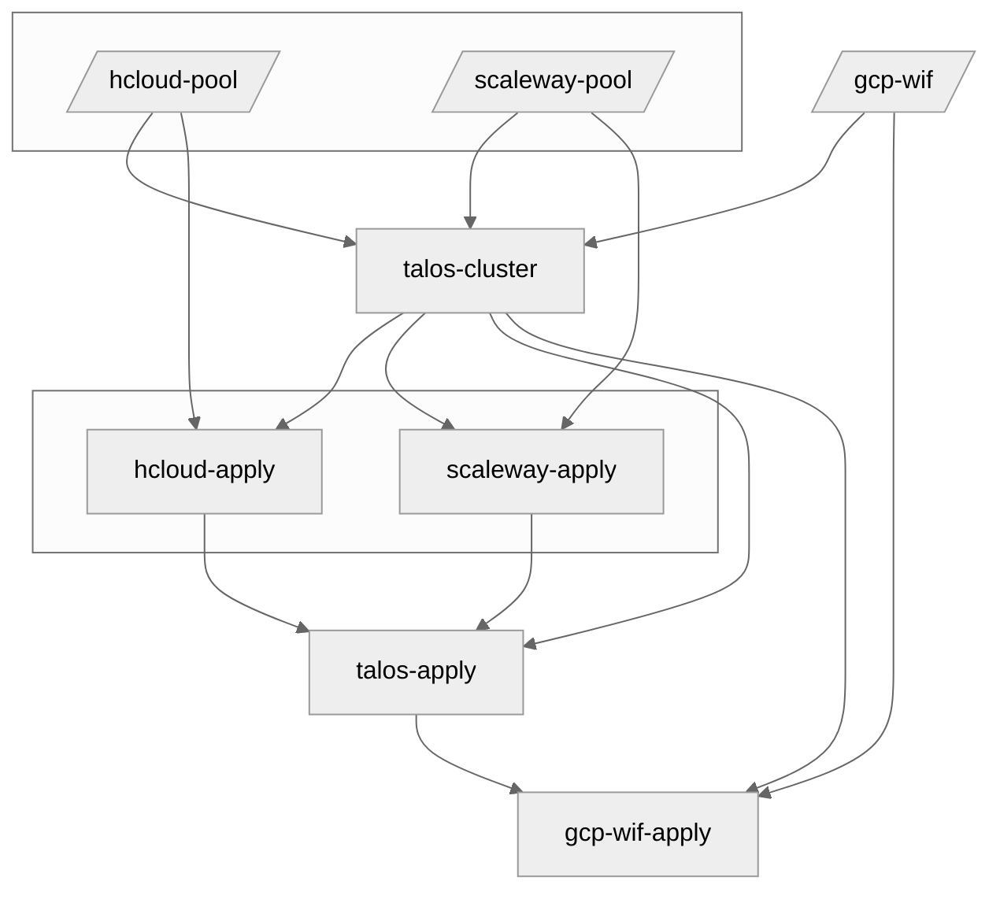

# terraform-talos-modules
Modules in this repository help provision and maintain multi-region [Kubernetes](https://kubernetes.io) clusters on [Hetzner Cloud](https://www.hetzner.com) and [Scaleway](https://www.scaleway.com).

## features
- [Talos Linux](https://www.talos.dev) with KubeSpan and KubePrism
- Single-stack IPv6 or IPv4 node connectivity - set `mode` on pool modules (`"ipv6"` default)
- IPv6 mode: NAT64 for outbound IPv4, single-stack IPv6 internals
- [Cilium](https://cilium.io) - tunnel mode (netkit), BigTCP and BBR; separate manifests for [IPv6](manifests/cilium-ipv6) and [IPv4](manifests/cilium-ipv4)
- [CoreDNS](manifests/coredns-ipv6) with `hostNetwork: true` — deployed via [manifests](manifests/README.md) separately from Talos bootstrap (see manifests note for rationale)
- [talos-ccm](https://github.com/siderolabs/talos-cloud-controller-manager) - optional, node IPAM (CloudAllocator) and cloud metadata, requires additional patches (see [examples/talos-ccm.tf](examples/talos-ccm.tf))
- [gcp-wif](modules/gcp-wif) + [gcp-wif-apply](modules/gcp-wif-apply) - optional GCP Workload Identity Federation integration

## modules

### cloud pools
Allocate node resources (IPs, placement groups). Pass their outputs to `talos-cluster` and the corresponding apply module.

| module | provider | description |
|---|---|---|
| [hcloud-pool](modules/hcloud-pool) | Hetzner Cloud | allocates primary IPs (IPv6 /64 or IPv4 /32) and a placement group |
| [scaleway-pool](modules/scaleway-pool) | Scaleway | allocates routed IPs (IPv6 or IPv4) and a placement group |

### cluster
| module | description |
|---|---|
| [talos-cluster](modules/talos-cluster) | generates machine secrets, config patches and user_data for all nodes |
| [talos-apply](modules/talos-apply) | bootstraps the cluster, manages config changes and rolling upgrades |

### apply
Provision servers. One apply module per pool.

| module | provider | description |
|---|---|---|
| [hcloud-apply](modules/hcloud-apply) | Hetzner Cloud | provisions servers and firewalls |
| [scaleway-apply](modules/scaleway-apply) | Scaleway | provisions servers, volumes and security groups |

### optional
| module | description |
|---|---|
| [scaleway-image](modules/scaleway-image) | registers a Talos qcow2 image from a Scaleway bucket as a bootable instance image |
| [gcp-wif](modules/gcp-wif) | manages a GCP workload identity pool, service accounts and OIDC bucket |
| [gcp-wif-apply](modules/gcp-wif-apply) | fetches OIDC documents from the running cluster and uploads them to GCP |

## examples

| example | description |
|---|---|
| [minimal.tf](examples/minimal.tf) | single Hetzner Cloud pool, single-region cluster |
| [multi-region.tf](examples/multi-region.tf) | two Hetzner Cloud pools across regions |
| [multi-cloud.tf](examples/multi-cloud.tf) | Scaleway control planes + Hetzner Cloud workers, Scaleway LB as cluster endpoint |
| [scaleway-lb.tf](examples/scaleway-lb.tf) | Scaleway cluster with a load balancer frontend for Talos and Kubernetes APIs |
| [talos-ccm.tf](examples/talos-ccm.tf) | talos-ccm integration with node IPAM and cloud metadata |

## diagram
The following [Mermaid](https://github.com/mermaid-js/mermaid) flowchart outlines the order of operations between modules for a cluster spanning two regions.

```mermaid
%%{init: {'theme': 'neutral'} }%%
graph TD
    subgraph pools[ ]
        HPN[/hcloud-pool/]
        SPN[/scaleway-pool/]
    end
    subgraph apply[ ]
        HA[hcloud-apply]
        SA[scaleway-apply]
    end
    WIF[/gcp-wif/]
    TC[talos-cluster]
    TA[talos-apply]
    WIFA[gcp-wif-apply]
    HPN --> TC
    HPN --> HA
    SPN --> TC
    SPN --> SA
    WIF --> TC
    WIF --> WIFA
    TC --> HA
    TC --> SA
    TC --> TA
    TC --> WIFA
    HA --> TA
    SA --> TA
    TA --> WIFA
```

## development
See the [dev](dev) folder for a reference deployment used for testing.
